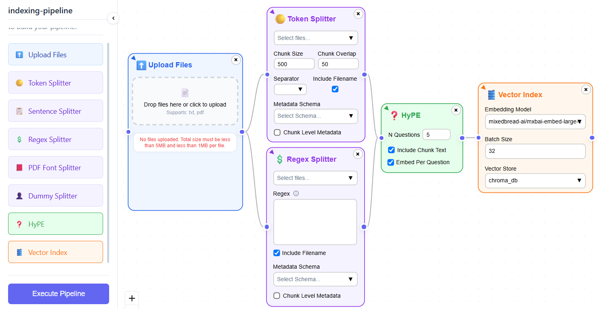
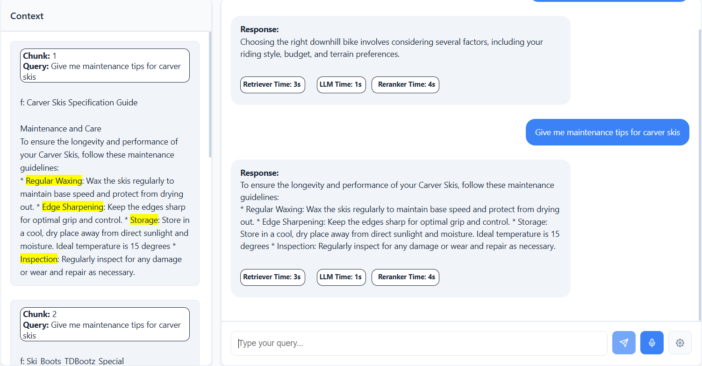
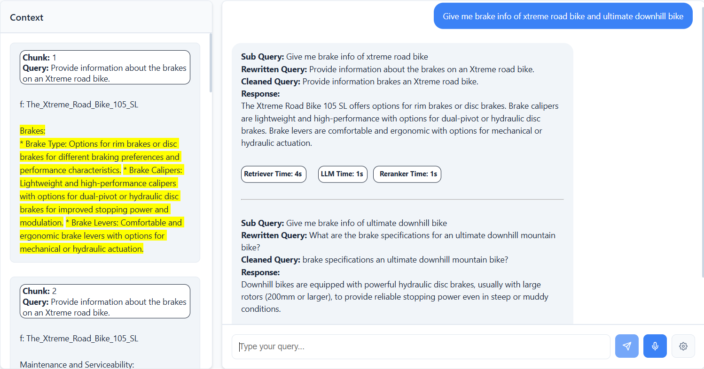
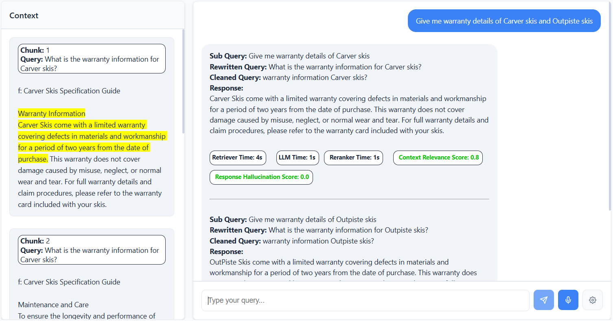
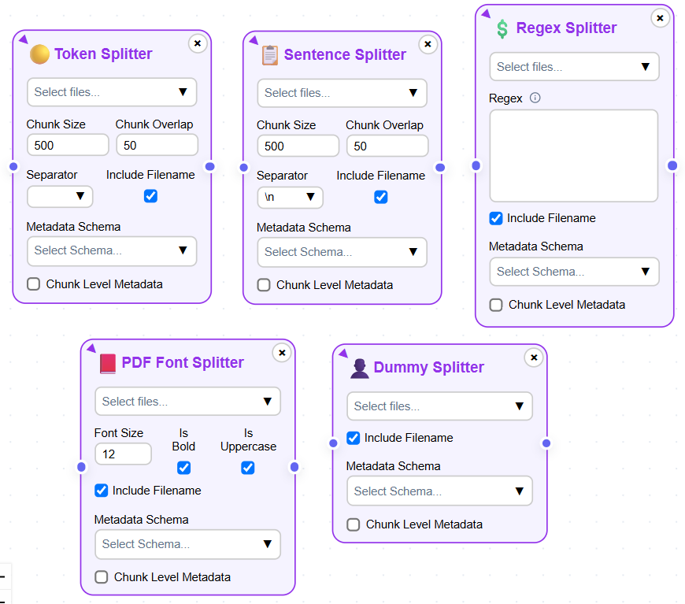
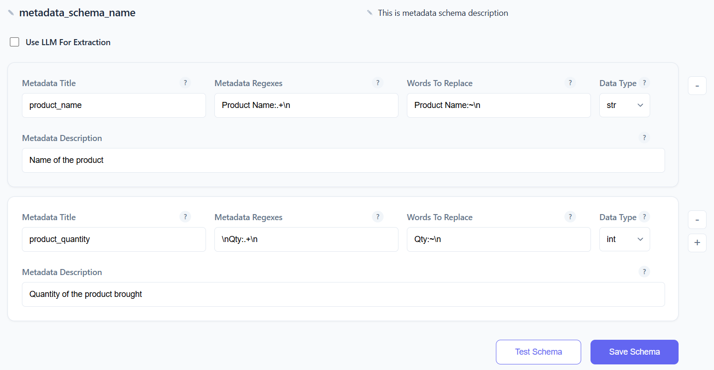
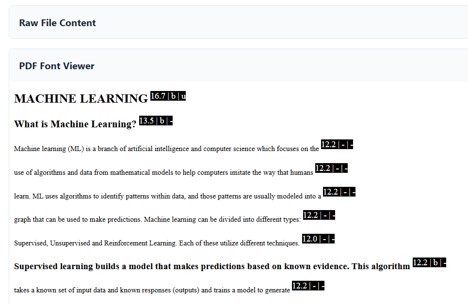

Features
============================

MRAG application comes with lot of features to enable a user to index the documents, chat with the index documents. 
Below are the details of the features present in MRAG application.

======================================
Provides Drag & Drop UI
======================================

.. raw:: html

    

.. raw:: html

    

- You can build indexing pipelines using a drag-and-drop UI.
- Simply drag and drop the components availabe on to the canvas and connect them to build a pipeline.

======================================
Provides Interactive QA Bot
======================================

.. raw:: html

    

.. raw:: html

    

- You can chat with your documents by asking questions to the chatbot. 
- MRAG also supports voice chat where you can use your voice to ask a question.
- The retrieved context will be shown on the left (relevant text will be highlighted in yellow) for the user to verify the correctness of the bot's response.
- Each indexing pipeline will have its own chatbot and associated settings.

======================================
Customizable QA Chat Bot Settings
======================================

.. raw:: html

    

.. image:: images/features/chat_settings.gif
   :alt: Chat Settings
   :align: center
   :class: bordered-image

.. raw:: html

    

- MRAG allows a user to configure the following settings
    - Prompt Template
    - Query Settings 
        - Query Cleaning
        - Query Rewriting
        - Query Decomposition
        - Self Querying
    - Retrieval Techniques
        - Simple Vector Retriever
        - Multi Query / Query Expansion Retriever
        - Reciprocal Rank Fusion (RRF) Retriever
    - Retriever Settings
        - Similarity Top K
        - Sparse Top K
        - Hybrid Top K
        - Hybrid Search Alpha
    - Reranker Settings
        - Reranker Model
        - Reranker Top K
    - Context Compression / Denoising
        - Context Extraction
        - Context Filtering
    - LLM Settings
        - Model
        - Model Temperature 
    - Post-processing of response
        - Combine sub query responses
    - Metrics
        - Context Relevance Score
        - Response Hallucination Score

======================================
Supports Query Enrichment
======================================

.. raw:: html

    

.. raw:: html

    

- Enables users to enrich the query for better retrieval and LLM responses.
- Supports query decomposition by generating sub queries to fetch answers for multiple queries in a single request.
- Supports query cleaning and query rewriting for better retrieval and LLM response.

======================================
Enables Context Enrichment
======================================

.. raw:: html

    

.. raw:: html

    

- Enables a user to enrich the context using HyPE technique.
- HyPE technique generates hypothetical prompts / queries using an LLM that can be answered using the information in the chunk. 
- User can select the number of hypothetical queries to generate.
- Improves retrieval quality by comparing user's query with hypothetical queries for similarity.

======================================
Provides Evaluation Metrics
======================================

.. raw:: html

    

.. raw:: html

    

- Enables users to evaluate the performance of the retriever and LLM responses.
- Context relevance score helps in evaluating the retriever's performance.
- Response hallucination score helps in evaluation the LLM response quality.

======================================
Provides Query Suggestions
======================================

.. raw:: html

    

.. image:: images/features/query_suggestions.png
   :alt: Query Suggestions
   :align: center
   :class: bordered-image

.. raw:: html

    

- Provides query suggestions to the user if a user includes HyPE in the indexing pipeline.
- Enables user to view the query suggestions for each document separately.
- Helps a user in getting an overview of the questions a document can answer.

======================================
Provides Multiple Splitters
======================================

.. raw:: html

    

.. raw:: html

    

- Provides 5 splitters to chunk the documents.
- Supports custom splitters like Regex Splitter, PDF Font Splitter and Dummy Splitter.
- User can apply different splitter for different documents based on the document structure which ensures smart chunking.

======================================
Provides Metadata Extractor
======================================

.. raw:: html

    

.. raw:: html

    

- Provides metadata extractor to extract metadata using regular expressions from documents.
- Extracted metadata can be used in splitters to enable self querying.
- Self querying enables user to filter and retrieve the documents based on metadata.

======================================
Enables Metadata Testing
======================================

.. raw:: html

    

.. image:: images/features/metadata_test.png
   :alt: Metadata Test
   :align: center
   :class: bordered-image

.. raw:: html

    

- Enables a user to test the metadata extraction by uploading a sample document.
- The user can view the metadata extracted using the schema defined by the user.
- The user can also see the raw text of the document along with the extracted metadata.

======================================
Provides Document Viewer
======================================

.. raw:: html

    

.. raw:: html

    

- Enables a user to view the raw file content as well as the fonts in a PDF file.
- This enables the user to decide the chinking strategy to use.
- Aids in smart chunking strategy as per the document structure.

======================================
Provides Document Chunk Viewer
======================================

.. raw:: html

    

.. raw:: html

    

- Enables users to view the chunks before building an indexing pipeline.
- Enables users to compare multiple splitters and choose the best one for their documents.
- Enables users to apply multiple splitters to a document.

======================================
Supports Text and PDF Documents
======================================

- Supports text and pdf document types.
- Users can upload the documents from their local storage.
- Total size of documents should be less than 5MB.
- Individual document size must be less than 1MB.

