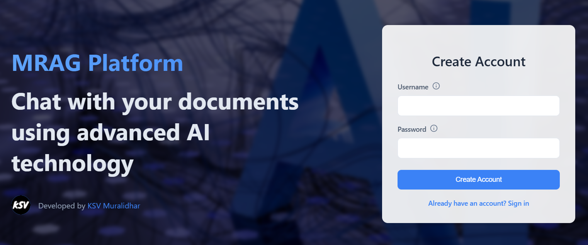

Getting Started
================

This section explains the process to get started with MRAG application. 
The process of creating an account and logging into the MRAG application will be explained here.

=====================
Creating an account
=====================
.. raw:: html

    

.. raw:: html

    

In the Create Account page, enter the username and password of your choice. 

.. raw:: html

   <h4>Username and password requirements</h4>

- Username and password must contain only lowercase alphabets and hypen.
- Username and password cannot contain numbers and special characters barring hypen.

============================
Logging into your account
============================
.. raw:: html

    

.. raw:: html

    

After successful registration you will be automatically redirected to the Sign In page.

Enter your username and password to log in to your account. 

