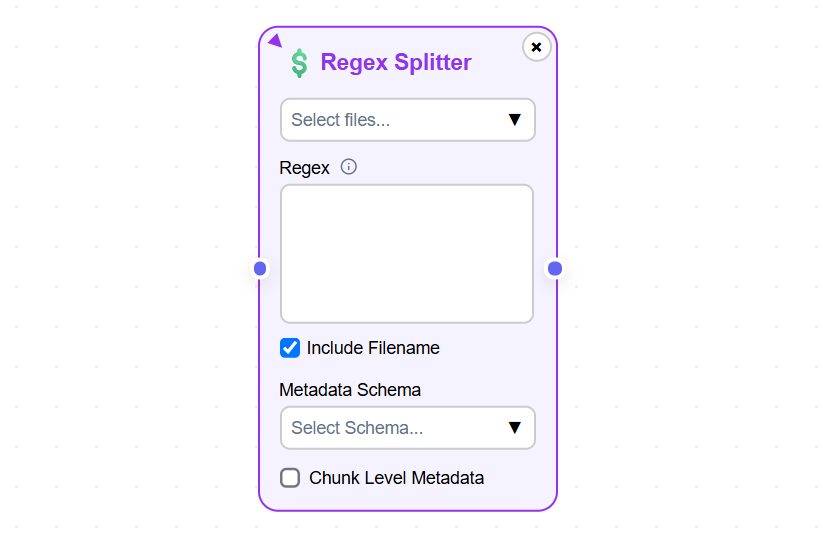

Building Indexing Pipelines
============================

Indexing is the first step in your RAG journey. Indexing involves reading text from your documents 
and splitting them into smaller units called chunks. The chunks are converted into vector embeddings 
using an embedding model. These embeddings along with the text and associated metadata are inserted into a vector store.

======================================
Creating your first indexing pipeline
======================================

1. When you first log into the application you will see the Indexing Pipelines page as shown in the 
image below.

.. raw:: html

    

.. raw:: html

    

2. You will see a message saying no indexing pipelines found. Click on **Create** button to create a new indexing pipeline. 
After clicking on the **Create** button you will see a 
popup dialog box asking to name the indexing pipeline as shown in the image below.

.. raw:: html

    

.. image:: images/4_pipeline_name.png
   :alt: Name the indexing pipeline
   :align: center
   :class: bordered-image

.. raw:: html

    

.. raw:: html

   <h4>Pipeline name requirements</h4>

- Indexing pipeline name must contain only lowercase alphabets and hypen.
- Indexing pipeline name cannot contain numbers and special characters barring hypen.

.. raw:: html

    

3. After entering the indexing pipeline name and hitting the **Create** button in the popup dialog box 
you will see the Indexing Pipeline canvas where you can build your indexing pipeline as shown in the image below.

.. raw:: html

    

.. raw:: html

    

4. Drag and drop the components present in the sidebar on the left to build your indexing pipeline.

========================================
Supported document formats
========================================

.. raw:: html

    

Currently, MRAG allows a user to upload .txt and .pdf documents only. Each document must be less than 1MB and 
the total documents' size must be less than 5MB.

You should use the **Upload File** component show in the above image to upload your documents. 
This should be the first component of your indexing pipeline.

========================================
Supported document splitters
========================================

Document splitters divides the document text into smaller units called chunks. 

- MRAG supports multiple document splitters.
- Each splitter can be applied to multiple documents.
- Multiple splitters can be applied to a single document by selecting the document in multiple splitter components.
- Files uploaded using the Upload File component must be selected in at least one splitter component. 

Currently, MRAG supports document splitters like 

- **Token Splitter**
- **Sentence Splitter**
- **Regex Splitter**
- **PDF Font Splitter**
- **Dummy Splitter**

A user can drag and drop these document splitter components on to the canvas to build the indexing pipeline.
Below are the details of the document splitters.

.. raw:: html

    

Token Splitter
^^^^^^^^^^^^^^^

.. image:: images/7_token_splitter.png
   :alt: Token Splitter
   :align: center

**Token Splitter** splits a document into chunk based on the tokens present in the document. 
This component has multiple parameters that are described below. 

.. raw:: html

   Select Files
   
Select Files dropdown list enables a user to select the documents to which the splitter must be applied to. 
   A user can select multiple files in the dropdown list.

.. raw:: html

   Chunk Size
   
Chunk Size enables a user to specify the maximum number of tokens to be present in a single chunk.

.. raw:: html

   Chunk Overlap
   
Chunk Overlap enables a user to specify the number of tokens 
   at the end of the previous chunk to be appended to the start of the current chunk. 
   This ensures that the text is not split abruptly resulting in context loss.

.. raw:: html

   Separator
   
Separator enables a user to specify the delimiter to use for splitting the tokens.

.. raw:: html

   Include Filename
   
Include Filename enables a user to choose whether to include the filename in the chunk metadata. 
   Including the filename in the chunk improves retriever preformance and LLM response.

.. raw:: html

   Metadata Schema
   
Metadata Schema dropdown list enables a user to choose the metadata schema to extract metadata from the document/chunk. 
   Including metadata in a chunk enables self query. Only a single schema can be selected in a splitter component.

.. raw:: html

   Chunk Level Metadata
   
Chunk Level Metadata enables a user to choose whether the metadata must be extracted from the document as a whole or 
   from each chunk independently.

.. raw:: html

    

.. .. raw:: html

..    <h4 style="padding-top:7px;padding-bottom:7px;">Sentence Splitter</h4>

Sentence Splitter
^^^^^^^^^^^^^^^^^^

**Sentence Splitter** splits a document into chunks while preserving the sentence. 
This component has multiple parameters that are described below. 

.. raw:: html

   Select Files
   
Select Files dropdown list enables a user to select the documents to which the splitter must be applied to. 
   A user can select multiple files in the dropdown list.

.. raw:: html

   Chunk Size
   
Chunk Size enables a user to specify the maximum number of tokens to be present in a single chunk.

.. raw:: html

   Chunk Overlap
   
Chunk Overlap enables a user to specify the number of tokens 
   at the end of the previous chunk to be appended to the start of the current chunk. 
   This ensures that the text is not split abruptly resulting in context loss.

.. raw:: html

   Separator
   
Separator enables a user to specify the delimiter to use for splitting the document.

.. raw:: html

   Include Filename
   
Include Filename enables a user to choose whether to include the filename in the chunk metadata. 
   Including the filename in the chunk improves retriever preformance and LLM response.

.. raw:: html

   Metadata Schema
   
Metadata Schema dropdown list enables a user to choose the metadata schema to extract metadata from the document/chunk. 
   Including metadata in a chunk enables self query. Only a single schema can be selected in a splitter component.

.. raw:: html

   Chunk Level Metadata
   
Chunk Level Metadata enables a user to choose whether the metadata must be extracted from the document as a whole or 
   from each chunk independently.

.. raw:: html

    

.. .. raw:: html

..    <h4 style="padding-top:7px;padding-bottom:7px;">Sentence Splitter</h4>

Regex Splitter
^^^^^^^^^^^^^^^^^^

**Regex Splitter** splits a document into chunks based on the regular expressions provided by the user. 
This results in smart chunking where the complete section of a document is present as a single. 
For example, a user can split the document into chunks based on the section number (1, 1.2, 1.2.2, etc). 
This ensures the whole section of a document is present in a single chunk.
This component has multiple parameters that are described below. 

.. raw:: html

   Select Files
   
Select Files dropdown list enables a user to select the documents to which the splitter must be applied to. 
   A user can select multiple files in the dropdown list.

.. raw:: html

   Regex
   
Regex enables a user to specify the regular expressions to use for splitting the document. 
   A user can specify multiple regular expressions using ~ as the delimiter.

.. raw:: html

   Include Filename
   
Include Filename enables a user to choose whether to include the filename in the chunk metadata. 
   Including the filename in the chunk improves retriever preformance and LLM response.

.. raw:: html

   Metadata Schema
   
Metadata Schema dropdown list enables a user to choose the metadata schema to extract metadata from the document/chunk. 
   Including metadata in a chunk enables self query. Only a single schema can be selected in a splitter component.

.. raw:: html

   Chunk Level Metadata
   
Chunk Level Metadata enables a user to choose whether the metadata must be extracted from the document as a whole or 
   from each chunk independently.

.. raw:: html

    

.. .. raw:: html

..    <h4 style="padding-top:7px;padding-bottom:7px;">Sentence Splitter</h4>

PDF Font Splitter
^^^^^^^^^^^^^^^^^^

**PDF Font Splitter** splits a document into chunks based on the combination font size, case (upper or lower) and font weight (bold or not). 
This results in smart chunking where the complete section of a document is present as a single. 
For example, a user can split the document into chunks based on the font style of a section title (size 18, bold and uppercase). 
This ensures the whole section of a document is present in a single chunk.
This component has multiple parameters that are described below. 

.. raw:: html

   Select Files
   
Select Files dropdown list enables a user to select the documents to which the splitter must be applied to. 
   A user can select multiple files in the dropdown list.

.. raw:: html

   Font Size
   
Font Size enables a user to specify the font size where a document must be split.

.. raw:: html

   Is Bold
   
Is Bold enables a user to choose the font weight where a document must be split.

.. raw:: html

   Is Uppercase
   
Is Uppercase enables a user to choose the case where a document must be split.

.. raw:: html

   Include Filename
   
Include Filename enables a user to choose whether to include the filename in the chunk metadata. 
   Including the filename in the chunk improves retriever preformance and LLM response.

.. raw:: html

   Metadata Schema
   
Metadata Schema dropdown list enables a user to choose the metadata schema to extract metadata from the document/chunk. 
   Including metadata in a chunk enables self query. Only a single schema can be selected in a splitter component.

.. raw:: html

   Chunk Level Metadata
   
Chunk Level Metadata enables a user to choose whether the metadata must be extracted from the document as a whole or 
   from each chunk independently.

.. raw:: html

    

.. .. raw:: html

..    <h4 style="padding-top:7px;padding-bottom:7px;">Sentence Splitter</h4>

Dummy Splitter
^^^^^^^^^^^^^^^^^^

**Dummy Splitter** as the name suggests acts just as placeholder in cases when the whole document must be considered as a chunk.
It is useful in cases when the document is very small or difficult to decide on the splitting strategy.
This component has multiple parameters that are described below. 

.. raw:: html

   Select Files
   
Select Files dropdown list enables a user to select the documents to which the splitter must be applied to. 
   A user can select multiple files in the dropdown list.

.. raw:: html

   Include Filename
   
Include Filename enables a user to choose whether to include the filename in the chunk metadata. 
   Including the filename in the chunk improves retriever preformance and LLM response.

.. raw:: html

   Metadata Schema
   
Metadata Schema dropdown list enables a user to choose the metadata schema to extract metadata from the document/chunk. 
   Including metadata in a chunk enables self query. Only a single schema can be selected in a splitter component.

.. raw:: html

   Chunk Level Metadata
   
Chunk Level Metadata enables a user to choose whether the metadata must be extracted from the document as a whole or 
   from each chunk independently.

========================================
Executing the pipeline
========================================

.. raw:: html

    

.. raw:: html

    

After you drag and drop the components on to the canvas and build the indexing pipeline, click the **Execute Pipeline** 
button in the left sidebar to execute the pipeline. The pipeline will be executed as a background job. Once the job begins 
you will be automatically redirected to the Indexing Pipelines screen. You can view the list of your Indexing Pipelines 
and track the execution status of a pipeline by hitting the **Refresh** button. 

.. raw:: html

    

