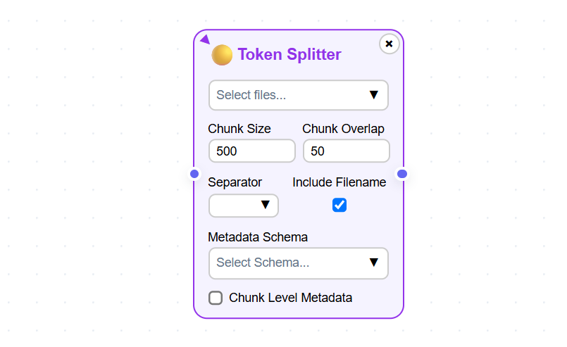

Building Indexing Pipelines
============================

Indexing is the first step in your RAG journey. Indexing involves reading text from your documents 
and splitting them into smaller units called chunks. The chunks are converted into vector embeddings 
using an embedding model. These embeddings along with the text and associated metadata are inserted into a vector store.

======================================
Creating your first indexing pipeline
======================================

1. When you first log into the application you will see the Indexing Pipelines page as shown in the 
image below.

.. raw:: html

    

.. image:: images/3_create_indexing_pipeline.png
   :alt: Creating an indexing pipeline
   :align: center
   :class: bordered-image

.. raw:: html

    

2. You will see a message saying no indexing pipelines found. Click on **Create** button to create a new indexing pipeline. 
After clicking on the **Create** button you will see a 
popup dialog box asking to name the indexing pipeline as shown in the image below.

.. raw:: html

    

.. raw:: html

    

.. raw:: html

   <h4>Pipeline name requirements</h4>

- Indexing pipeline name must contain only lowercase alphabets and hypen.
- Indexing pipeline name cannot contain numbers and special characters barring hypen.

.. raw:: html

    

3. After entering the indexing pipeline name and hitting the **Create** button in the popup dialog box 
you will see the Indexing Pipeline canvas where you can build your indexing pipeline as shown in the image below.

.. raw:: html

    

.. image:: images/5_indexing_pipeline_canvas.png
   :alt: Indexing pipeline canvas
   :align: center
   :class: bordered-image

.. raw:: html

    

4. Drag and drop the components present in the sidebar on the left to build your indexing pipeline.

========================================
Supported document formats
========================================

.. image:: images/6_upload_files_component.png
   :alt: Upload Files Component
   :align: center

.. raw:: html

    

Currently, MRAG allows a user to upload .txt and .pdf documents only. Each document must be less than 1MB and 
the total documents' size must be less than 5MB.

You should use the **Upload File** component show in the above image to upload your documents. 
This should be the first component of your indexing pipeline.

========================================
Supported document splitters
========================================

Document splitters divides the document text into smaller units called chunks. 

- MRAG supports multiple document splitters.
- Each splitter can be applied to multiple documents.
- Multiple splitters can be applied to a single document by selecting the document in multiple splitter components.
- Files uploaded using the Upload File component must be selected in at least one splitter component. 

Currently, MRAG supports document splitters like 

- **Token Splitter**
- **Sentence Splitter**
- **Regex Splitter**
- **PDF Font Splitter**
- **Dummy Splitter**

A user can drag and drop these document splitter components on to the canvas to build the indexing pipeline.
Below are the details of the document splitters.

.. raw:: html

   <h4 style="padding-top:7px;padding-bottom:7px;">Token Splitter</h4>

**Token Splitter** splits a document into chunk based on the tokens present in the document. 
This component has multiple parameters that are described below. 

.. raw:: html

   Select Files
   
Select Files dropdown list enables a user to select the documents to which the splitter must be applied to. 
   A user can select multiple files in the dropdown list.

.. raw:: html

   Chunk Size
   
Chunk Size enables a user to specify the maximum number of tokens to be present in a single chunk.

.. raw:: html

   Chunk Overlap
   
Chunk Overlap enables a user to specify the number of tokens 
   at the end of the previous chunk to be appended to the start of the current chunk. 
   This ensures that the text is not split abruptly resulting in context loss.

