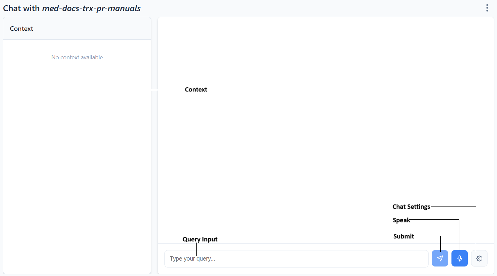
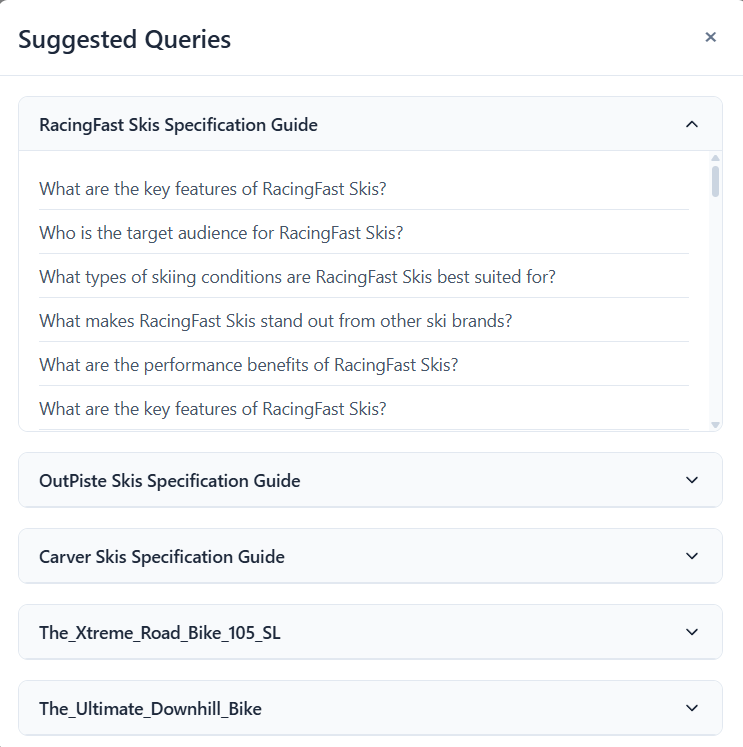

Q&A Chatbot
=============

Using the Q&A chatbot you can ask questions and get answers from your indexed documents. 
You can access the chatbot of an indexing pipeline from the indexing pipelines list.
Click on **Chat** menu item from the **Actions** menu of a specific pipeline as shown in the image below.

.. raw:: html

    

.. image:: images/14_view_chatbot.png
   :alt: View Chatbot
   :align: center
   :class: bordered-image

============================
Chatbot components
============================
.. raw:: html

    

.. raw:: html

    

The chatbot has the components listed below.

- **Query Input**: Query input lets a user enter the query.

- **Submit**: The submit button is next to the Query Onput text input. A user hits the Submit button after entering the query.

- **Speak**: The Speak button is next to the Submit button. A user can click it, ask his query and hit the button again. Then the user's query will appear in the Query Input. 

- **Chat Settings**: The chat settings button displays the chat settings dialog box using which  a user can configure chat settings. 

============================
Chat Settings
============================
.. raw:: html

    

.. raw:: html

    

Using the chat settings, a user can configure the chat settings for a given pipeline. Each indexing pipeline has its own chat settings.
Below are the settings a user can configure.

.. raw:: html

    

Prompt Template
^^^^^^^^^^^^^^^^^

.. raw:: html

    

.. raw:: html

    

Prompt template enables a user to configure the prompt sent to  the LLM. The Prompt Template must definitely contain **{context_str}** and 
**{query}** placeholders that represent retreived context and the user query respectively.

.. raw:: html

    

Query Settings
^^^^^^^^^^^^^^^^^

.. raw:: html

    

.. raw:: html

    

Query Settings enables a user to configure the settings for query enrichment. Below is the description of each query setting.

.. raw:: html

   Clean Query
   
Cleans a query by removing few unwanted stop words. The cleaned query is used only for retrieval that may result in a more efficient retrieval. However, once the context is retrieved it is combined with the original user query and sent to LLM for response.

.. raw:: html

   Rewrite Query
   
Rewrites the user query using an LLM, such that it results in more efficient context retrieval and LLM response.
   

.. raw:: html

   Generate Sub Queries
   
Implements query decomposition where a user query is divided into multiple sub queries and each sub query is handled independently.
   This helps when a user query has multiple sub queries in a single query. 
   In such a case the context might not be retrieved properly for all the sub queries.
   

.. raw:: html

   Enable Self Query
   
Enables metadata filtering where the chunks are filtered using metadata filters. If no chunks are retrieved after metadata filtering 
   then the chunks are retrieved using vector index retrieval. 
   This setting is enabled only if at least one splitter in the indexing pipeline has a metadata schema selected. 
   

.. raw:: html

    

Retrieval Techniques
^^^^^^^^^^^^^^^^^^^^

.. raw:: html

    

.. raw:: html

    

Retrieval Techniques enable a user to choose the right technique for efficient retrieval. Below is the description of each retrieval technique.

.. raw:: html

   Simple Retriever
   
Performs simple vector index retrieval that uses cosine similarity to retrieve the relevant top-k chunks from the vector store.

.. raw:: html

   Multi Query Retriever
   
Implements query expansion by generating <b>N Queries</b> using an LLM such that the user query is represented in multiple forms 
   resulting in efficient retrieval. Then top-k (specified using Similarity Top K in Retriever Settings) chunks are retrieved for each query. 
   The chunks retrieved by all the queries are first sorted in descending order based on similarity score 
   and deduplicated and top-k chunks are returned as context. 
   

.. raw:: html

   RRF Retriever
   
Implements Reciprocal Rank Fusion (RAG Fusion) by generating <b>N Queries</b> using an LLM such that the user query is represented in multiple forms 
   resulting in efficient retrieval. 
   Then top-k (specified using Similarity Top K in Retriever Settings) chunks are retrieved for each query.
   The reciprocal rank of the chunks retrieved by each query is computed independently. 
   Then the reciprocal rank of a context retrieved from all the queries is summed to get a final reciprocal rank for a chunk. 
   Then the chunks are sorted in descending order and top-k chunks are returned as context.
   

.. raw:: html

    

Retriever Settings
^^^^^^^^^^^^^^^^^^^^

.. raw:: html

    

.. raw:: html

    

Retriever Settings enable a user to configure the settings related to number of chunks to retrieve from vector store. 
Below is the description of each retriever setting.

.. raw:: html

   Similarity Top K
   
Number of chunks to retrieve using dense vectors.

.. raw:: html

   Sparse Top K
   
Applies only when the vector store supports hybrid search. Number of chunks to be retrieved using sparse vectors.
   

.. raw:: html

   Hybrid Top K
   
Applies only when the vector store supports hybrid search. Final number of top-k chunks (sparse + dense) to be retrieved from vector store.
   

.. raw:: html

   Hybrid Search Alpha
   
Applies only when the vector store supports hybrid search. When 0, sparse vector retrieval is enabled. When 1, dense vector search is enabled.
   Anythin between 0 and 1 balances both sparse and dense vector retrieval.
   

.. raw:: html

    

Reranker Settings
^^^^^^^^^^^^^^^^^^^^

.. raw:: html

    

.. raw:: html

    

Reranker Settings enable a user to configure the settings related to reranker. 
Below is the description of each reranker setting.

.. raw:: html

   Enable Reranker
   
Whether reranker must be enabled.

.. raw:: html

   Reranker Model
   
Choose the reranker model.

.. raw:: html

   Reranker Top K
   
Top-k chunks to return after reranking.

.. raw:: html

    

Context Compression / Denoising
^^^^^^^^^^^^^^^^^^^^^^^^^^^^^^^^^

.. raw:: html

    

.. raw:: html

    

Context Compression / Denoising Settings enable a user to configure the settings related to filtering or denoising the retrieved context from vector store. 
These settings are enabled only when the reranker is not enabled. Below is the description of each Context Compression / Denoising setting. 

.. raw:: html

   Extract Context
   
Extracts relevant information using an LLM from the retrieved context required to answer a user query.

.. raw:: html

   Filter Context
   
Returns only the chunks relevant to the user query using an LLM from the chunks retrieved from the vector store.

.. raw:: html

    

LLM Settings
^^^^^^^^^^^^^

.. raw:: html

    

.. raw:: html

    

LLM Settings enable a user to configure the settings related to the large language model. Below is the description of each LLM setting. 

.. raw:: html

   LLM Model
   
Large language model to use for generating LLM responses wherever required like Query Rewriting, Context Filtering, etc.

.. raw:: html

   Temperature
   
Set the LLM model's temperature. Value close to 0 returns deterministic response and value close to 1 returns probabilistic response.

.. raw:: html

    

Response Processing
^^^^^^^^^^^^^^^^^^^^

.. raw:: html

    

.. raw:: html

    

Response Processing Settings enable a user to configure the settings related to response synthesis. 
Below is the description of each Response Processing setting. 

.. raw:: html

   Combine Sub Query Responses
   
Combines responses of sub queries into a single response. This setting is enabled only when "Generate Sub Queries" in "Query Settings" is enabled.

.. raw:: html

    

Metrics
^^^^^^^^^^^^^^^^^^^^

.. raw:: html

    

.. raw:: html

    

Metrics settings enable to user to choose which metrics to be displayed in the chat response. 
Below is the description of each Metrics setting.

.. raw:: html

   Context Relevance Score
   
Context relevance score helps in evaluating the retriever's performance.

.. raw:: html

   Response Hallucination Score
   
Response hallucination score helps in evaluation the LLM response quality.

============================
Suggested Queries
============================
.. raw:: html

    

.. raw:: html

    

Suggested Queries feature shows the queries a document can answer. This feature is enabled only if a user includes HyPE component in the indexing pipeline.
Below screenshot shows how to access this feature.

.. raw:: html

    

.. raw:: html

    

In the Chatbot screen click on the menu on the top right to access the "Suggested Queries" feature. 
This will display the suggested queries for each document extracted using HyPE when it is included in the indexing pipeline. 
If HyPE is not included in the indexing pipeline then suggested queries will not be available.
A user can select the required query and it will be inserted in the "Query Input" and the user can hit the "Submit" button after making any required changes to the query. 
